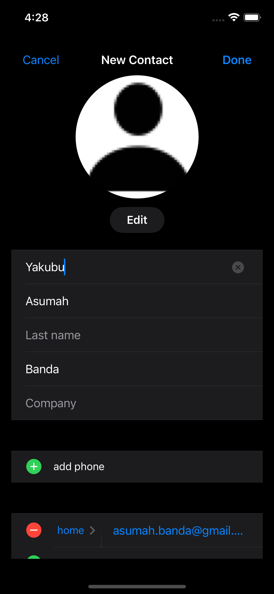
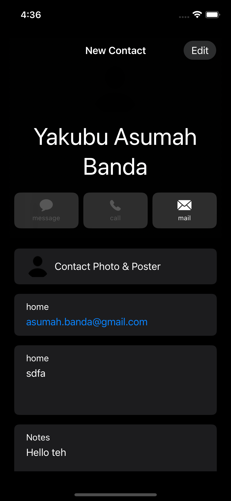
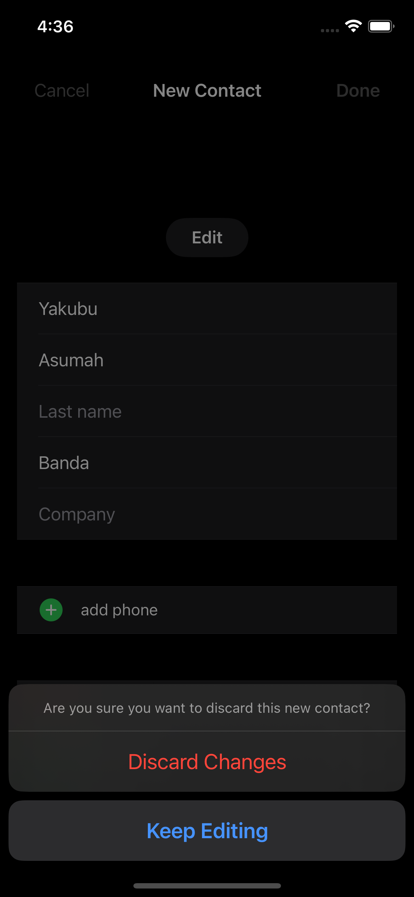

# Feature Name: Contact App View

## Description

This package provides a SwiftUI view (`ContactAppView`) and a supporting UIKit view controller (`ContactViewController`) to seamlessly integrate the iOS Contacts framework into your SwiftUI applications.  It allows users to easily create or edit contacts within your app, leveraging the native iOS Contacts UI.  The package handles the interaction with the `CNContactViewController`, abstracting away the complexities of integrating with the Contacts framework.

## Usage

1. **Add the Package:** Integrate this package into your Swift project using Swift Package Manager.
    * Open your Xcode project.
    * Go to **File > Swift Packages > Add Package Dependency...**
        * In the dialog box, paste [https://github.com/Uthman-lab/SwiftKnowledgeBase.git](https://github.com/Uthman-lab/SwiftKnowledgeBase.git).
    * **Crucially:**  Select "Branch" from the "Choose package dependency to add:" dropdown and type `add-to-contact-feature` into the text field to specify the branch.  You should see a preview of the package, its versions, etc.
    * Click "Next" to complete the package addition.    

2. **Import the Package:** Import the necessary modules into your SwiftUI view:

```swift
import ContactApp // Replace with your package's actual name
```


3. **Use `ContactAppView` in your SwiftUI code:** Embed the `ContactAppView` within your SwiftUI view, passing a `Contact` object:


```swift
struct MyView: View {
    var body: some View {
        VStack {
            ContactAppView(contact: Contact(
                givenName: "John",
                familyName: "Doe",
                // ... other properties ...
                imageData: UIImage(systemName: "person.fill")?.pngData() ?? Data() //Example image Data
            ))
        }
    }
}
```

4. **Handle the Result:** The view will present the native contact editing interface. When the user dismisses the view, you don't get a direct return value,  but the changes made to the contact will be saved in the system's Contacts app.

## Screenshots/Examples
<div>



</div>

## Known Issues/Future Improvements

* **UI Customization:**  Future versions might allow for greater customization of the UI, such as theming options or the ability to pre-select certain contact fields.  Add the ability to specify if this is creating a new contact or editing an existing one.

* **Support for Other Platforms:** Currently, this package only supports iOS. Support for macOS and other Apple platforms could be added.
